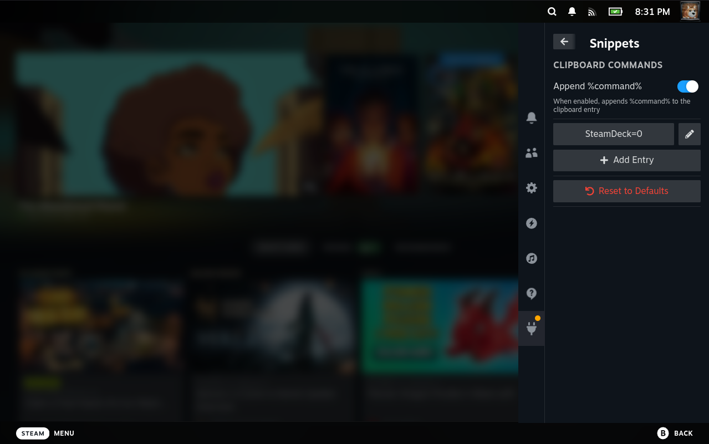

# Snippets

A Decky plugin that lets you save and use custom text snippets in Steam Deck game mode.



## Features

- Save named clipboard entries with custom commands
- One-tap copy to clipboard
- Optional command appending mode
- Persistent storage via Python backend

## Dev Setup

**Requirements:** Node.js 16.14+, pnpm v9

```bash
pnpm i
pnpm run build
```

Or in VS Code, run the `setup` → `build` → `deploy` tasks.

## License

BSD-3-Clause — see [LICENSE](LICENSE)
